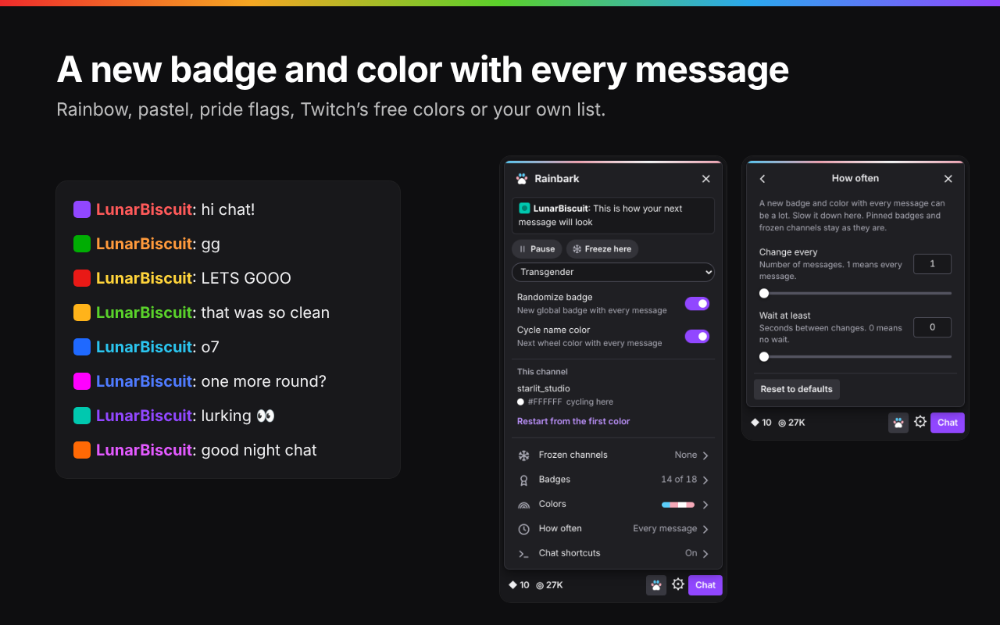

# Rainbark 🐶

A browser extension for Twitch chat. Every message you send gets a new global badge and a new name color.

## Install

| Browser | Get it from |
|---|---|
| Firefox | [Firefox Add-ons](FIREFOX_ADDONS_LINK) |
| Chrome, Brave, Opera, Vivaldi, Arc | [Chrome Web Store](https://chromewebstore.google.com/detail/jlofkdgmbeleekkegkiflmildahmhgdd) |

Needs Firefox 140+ or a Chromium browser 121+.

Most palettes need Twitch Turbo or Prime, because Twitch only lets those accounts pick any color. The "Twitch free colors" palette works for everyone.

## What it does

- **Colors:** a rainbow wheel, pastel, sunset and other palettes, 36 pride flags, Twitch's 15 free colors, or your own list. Each channel remembers where it is in the palette, and you can freeze a channel to keep one color there.
- **Badges:** shuffled or in your own order. Switch badges off, star favorites so they come up more often, pin one badge to a channel, or give a channel its own set.
- **How often:** on every message, every few messages, or no more than once every so many seconds.
- **Pronouns:** people's pronouns from [pr.alejo.io](https://pr.alejo.io) next to their names, styled the way you like.
- **Chat shortcuts:** type `>color` and it becomes your current hex code. `>help` lists the rest, and you can add your own snippets with extras like `{channel}`, `{time}` and `{pick:a|b|c}`.
- **Keyboard shortcut:** <kbd>Alt</kbd>+<kbd>Shift</kbd>+<kbd>R</kbd> opens the panel with quick Pause, Freeze and palette buttons.
- **Creator dashboard:** works in Stream Manager's chat too, with the same settings.
- **Languages:** English, Español, Français, Deutsch, Português, Русский and 日本語, following Twitch's language. Any text can be reworded from the panel.

## Getting started

A welcome page opens once after installing. Then open any Twitch channel while signed in: a paw button appears below the chat box, and a small card walks you through setup. Rainbark changes your badge and color with the same requests Twitch's own menus send, so it needs to see you do three things once:

1. Open Chat Identity (click your badge at the left of the chat box).
2. Pick any badge there.
3. Pick any name color there.

After that, send a message and watch it work. The panel's **Walkthrough** row has a short tour of everything else.

**If Twitch changes something** and one of those requests stops working, the card comes back with only the step that needs doing again. Your settings stay as they are.

**To change the keyboard shortcut,** go to `about:addons` → gear menu → **Manage Extension Shortcuts** in Firefox, or `chrome://extensions/shortcuts` in Chromium.

**If you also use Pronoun Tags,** Rainbark leaves pronouns to it. FrankerFaceZ's own Pronouns add-on can't be detected, so with both on you'd see two tags per name: turn one of them off.

**Something not working?** Open the panel → **Query hashes** → **Copy diagnostics**, and paste the report into an [issue](../../issues). It includes the channel you're on and your browser version, but no sign-in details and nobody's names.

## Privacy

Rainbark has no servers, no analytics and no ads. Badge and color changes go to Twitch from the Twitch page, exactly as if you'd used Twitch's menus. With pronouns on, the usernames of people in chat are sent to the pronouns API at `api.pronouns.alejo.io` to look up their pronouns. Settings stay in your browser. The details are in [PRIVACY.md](PRIVACY.md).

Rainbark isn't made by or affiliated with Twitch or pr.alejo.io.

## How it works

| File | Job |
|---|---|
| `manifest.json` | Declares the extension for both browsers. It runs on `www.twitch.tv` and `dashboard.twitch.tv`, asks for the `storage` permission, and may reach the pronouns API. |
| `page.js` | The panel, the color and badge rotation, chat shortcuts and the setup card. It runs inside the Twitch page itself (the "MAIN" world), because it has to see Twitch's requests and reach Twitch's chat box. |
| `languages.js` | All of the panel's text: `TEXT_GROUPS` (English, grouped the way the Text view shows it) and `LANGUAGES` (the other six). |
| `styles.js` | The panel's stylesheet, `STYLES`. |
| `pronoun-look.js` | How pronoun tags look: the choices, the formatting, and the stylesheet both the panel's preview and the real tags use. |
| `pronouns.js` | Finds names in chat and on About panels and puts the pronoun tags beside them. |
| `bridge.js` | Runs beside `page.js` with access to extension APIs. Keeps a copy of your settings in extension storage, shares them between tabs, and passes on the toolbar button and keyboard shortcut. |
| `background.js` | Opens the welcome page once after installing, handles the toolbar button and keyboard shortcut, and looks up pronouns (a few at a time, cached for an hour). A service worker in Chromium, an event page in Firefox. |
| `welcome.html`, `welcome.css`, `welcome.js` | The welcome page. |
| `_locales/` | The extension's description, the shortcut's name and the welcome page in each language. |

`languages.js`, `styles.js` and `pronoun-look.js` load just before `page.js` and hand it their parts through `window.__rainbarkParts`, which `page.js` removes once it has read them.

**Where settings live.** Settings are saved in Twitch's site storage in your browser, and a copy is kept in the extension's own storage. Each save is time-stamped and the newest one wins, so a change on the main site shows up on the dashboard and in other tabs. If Twitch's site storage comes up empty (you cleared site data, or your browser clears it on exit), the copy is restored and you don't have to set up again.

## Changing things

- **Text and languages:** `TEXT_GROUPS` and `LANGUAGES` in `languages.js`. A string a language leaves out is shown in English.
- **Look of the panel:** `STYLES` in `styles.js`.
- **Pronoun tag choices:** `DEFAULTS` and `CHOICES` in `pronoun-look.js`. A new choice also needs its option names in `languages.js`.
- **Palettes:** `PALETTE_GROUPS` in `page.js`. Each palette is a list of hex colors plus a name in `TEXT_GROUPS`.
- **Welcome page, shortcut name and store description:** `_locales/<language>/messages.json`.
- **Version:** `version` in `manifest.json` and `VERSION` in `page.js`. Keep them the same, and raise both for every store upload.
# Rainbark
A browser extension for Twitch chat. Every message you send gets a new global badge and a new name color.
